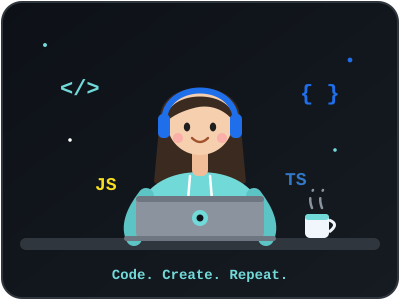

<!-- Animated banner -->

<!-- Typing animation -->

  

 

  

##  About Me

-  Passionate developer who loves turning ideas into working web apps
-  Built **3Arrow24x7**, a multi-vendor marketplace connecting customers with trusted service providers and worked on real estate project
-  Currently improving my skills in full-stack development and clean, scalable code
-  Ask me about: JavaScript, web development, building e-commerce apps
-  Fun fact: I ship first, then polish 😄

 

## 🛠️ Tech Stack

  

  

<!-- Add more icons as you learn them: react,nodejs,express,mongodb,mysql,python,tailwind,figma -->

 

##  Featured Projects

| Project | Description | Tech |
|---|---|---|
| [ multi-vendor-e-commerce-](https://github.com/Harshita07singh/multi-vendor-e-commerce-) | 3Arrow24x7: a digital service marketplace where customers discover services and vendors showcase theirs | JavaScript |
| [ quiz-app](https://github.com/Harshita07singh/quiz-app) | Interactive quiz application | JavaScript |
| [ patient-reminder](https://github.com/Harshita07singh/patient-reminder) | Reminder app to help patients stay on schedule | JavaScript |
| [ E-comm](https://github.com/Harshita07singh/E-comm) | E-commerce web app | JavaScript |
| [ oasis-task](https://github.com/Harshita07singh/oasis-task) | Front-end design task | CSS |

 

## 📊 GitHub Stats

  
  

  

 

## 🐍 Contribution Snake

<!-- Requires the snake.yml workflow (see setup steps). Remove this block if you skip it. -->

  <picture>
    <source media="(prefers-color-scheme: dark)" srcset="https://raw.githubusercontent.com/Harshita07singh/Harshita07singh/output/github-snake-dark.svg" />
    <source media="(prefers-color-scheme: light)" srcset="https://raw.githubusercontent.com/Harshita07singh/Harshita07singh/output/github-snake.svg" />
    
  </picture>

 

## 📫 Let's Connect

  
  

  

<!-- Animated footer -->

